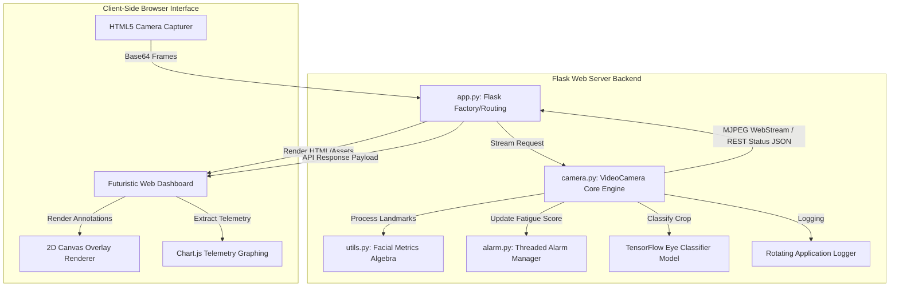
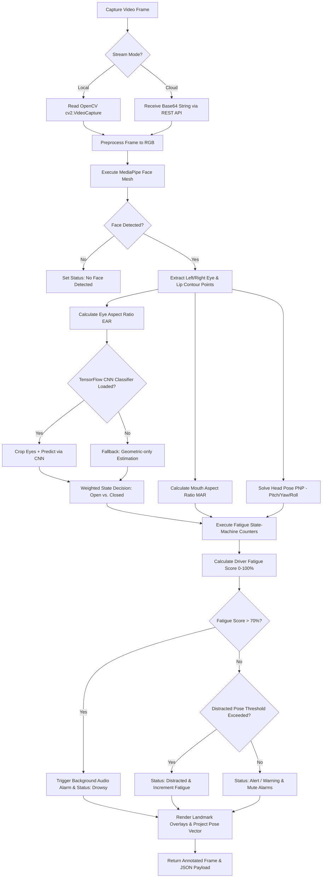
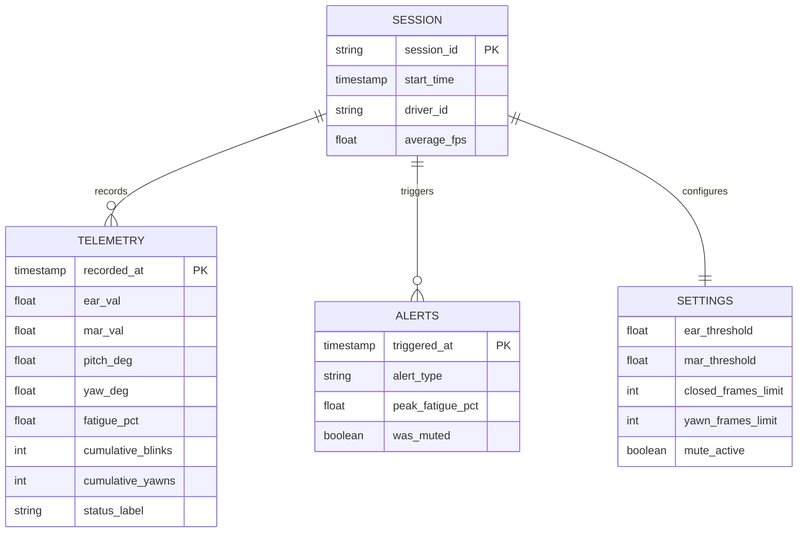
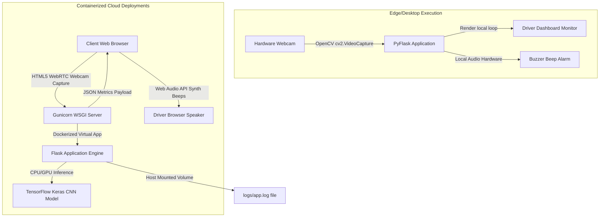

# Technical Architecture & System Diagrams

This document contains visual diagrams mapping out the design, workflow, interaction sequences, and deployment topography of the **Driver Drowsiness Detection System**.

---

## 1. System Architecture Diagram
Describes how the client interface, Flask web server, and asynchronous background engines interact.



---

## 2. Dynamic Workflow Diagram
Details the pipeline sequence for each frame captured by the system.



---

## 3. Interaction Sequence Diagram
Depicts the step-by-step transaction between client browser interactions, API routing, processing modules, and deep learning components.

```mermaid
sequenceDiagram
    autonumber
    actor Driver as Driver / User
    participant Browser as Web Browser Client
    participant App as Flask Router (app.py)
    participant Cam as Camera Engine (camera.py)
    participant TF as TensorFlow Predictor
    participant Alarm as Alarm Thread (alarm.py)

    Driver->>Browser: Open Dashboard UI
    Browser->>App: Request index.html / GET API config
    App-->>Browser: Return HTML Page & Threshold settings
    
    rect rgb(15, 30, 50)
        Note over Browser, Alarm: Real-time Frame Analysis Loop (12 FPS)
        Browser->>Browser: Capture webcam raw image
        Browser->>App: POST /api/process_frame (base64 JSON)
        App->>Cam: process_base64_frame(image)
        Cam->>Cam: Extract landmarks (Face Mesh)
        Cam->>TF: Predict crop matrices (Closed/Open)
        TF-->>Cam: Return float confidence scores
        Cam->>Cam: Calculate EAR, MAR, Head Pose angles
        Cam->>Cam: Increment fatigue state metrics
        
        alt Drowsy detected (>15 consec frames)
            Cam->>Alarm: trigger()
            Alarm->>Alarm: Play alert buzzer (thread loop)
        else Alert / Recovered
            Cam->>Alarm: stop()
            Alarm->>Alarm: Halt audio playback
        end
        
        Cam-->>App: Return annotated frame data & metrics JSON
        App-->>Browser: Return 200 OK Response
        Browser->>Browser: Render output canvas & update Chart.js
    end
```



---

## 4. Decision Flowchart
Logic flow for calculating fatigue scores based on sensor inputs.

```mermaid
flowchart TD
    Start([Frame Metrics Ingestion]) --> CheckClosed{Is eye closed?}
    
    CheckClosed -- Yes --> ConsecClosed[Increment Closed Frame Counter]
    ConsecClosed --> ClosedThreshold{Consec frames > Threshold?}
    ClosedThreshold -- Yes --> AlertDrowsy[State: Drowsy | Fatigue +4.0/frame | Alert Level: Critical]
    ClosedThreshold -- No --> CheckYawn{Is MAR > Mouth Threshold?}
    
    CheckClosed -- No --> ResetClosed[Reset Closed Frame Counter]
    ResetClosed --> CheckBlink{Was closed count > 0?}
    CheckBlink -- Yes --> AddBlink[Increment Blink Count]
    CheckBlink -- No --> CheckYawn
    AddBlink --> CheckYawn
    
    CheckYawn -- Yes --> ConsecYawn[Increment Yawn Frame Counter]
    ConsecYawn --> YawnThreshold{Consec frames > Yawn Threshold?}
    YawnThreshold -- Yes --> YawnAlert[Increment Yawn Count | Fatigue +15.0 once]
    YawnThreshold -- No --> CheckDistract{Is Pitch/Yaw out of bounds?}
    YawnAlert --> CheckDistract
    
    CheckYawn -- No --> ResetYawn[Reset Yawn Frame Counter]
    ResetYawn --> CheckDistract
    
    CheckDistract -- Yes --> ConsecDistract[Increment Distracted Frame Counter]
    ConsecDistract --> DistractThreshold{Consec frames > Distract Limit?}
    DistractThreshold -- Yes --> AlertDistracted[State: Distracted | Fatigue +0.8/frame | Alert Level: Warning]
    DistractThreshold -- No --> CalcScore
    
    CheckDistract -- No --> ResetDistract[Reset Distracted Frame Counter]
    ResetDistract --> AlertRecover[Fatigue -0.2/frame | Alert Level: Normal]
    AlertRecover --> CalcScore
    
    AlertDrowsy --> CalcScore
    AlertDistracted --> CalcScore
    
    CalcScore[Update Final Fatigue Score 0-100%] --> CheckAlarm{Fatigue > 70%?}
    CheckAlarm -- Yes --> SoundAlarm[Trigger Threaded Alarm sound]
    CheckAlarm -- No --> StopAlarm[Stop Alarm Sound]
    
    SoundAlarm --> End([End Frame Process])
    StopAlarm --> End
```

---

## 5. System Entity-Relationship (ER) Diagram
Defines the state data structures managed during a telemetry monitoring session.



---

## 6. Use Case Diagram
Maps out the system boundary actor activities.

```mermaid
left to right direction
actor Driver
actor FleetAdmin as Fleet Safety Manager

rectangle "AI Drowsiness Detection System" {
    usecase UC1 as "View Live Video Overlay"
    usecase UC2 as "Monitor Telemetry Gauges (EAR, MAR)"
    usecase UC3 as "Configure Detection Thresholds"
    usecase UC4 as "Trigger Auto Buzzer Alert"
    usecase UC5 as "Review Historical Charts"
    usecase UC6 as "Audit Safety Alert Timeline Logs"
}

Driver --> UC1
Driver --> UC2
Driver --> UC4
Driver --> UC5

UC3 --> FleetAdmin
UC6 --> FleetAdmin
UC5 --> FleetAdmin
```

---

## 7. Deployment Topography Diagram
Shows local and cloud execution hosting structures.



---

## 8. Workspace Folder Tree
The physical layout of files created for this project.

```
Driver-Drowsiness-Detection/
├── .github/
│   └── workflows/
│       └── deploy.yml
├── data/
│   ├── train/
│   │   ├── closed_eyes/
│   │   └── open_eyes/
│   ├── val/
│   │   ├── closed_eyes/
│   │   └── open_eyes/
│   └── test/
│       ├── closed_eyes/
│       └── open_eyes/
├── docs/
│   └── architecture.md
├── logs/
│   └── app.log
├── models/
│   └── eye_classifier.h5
├── static/
│   ├── css/
│   │   └── style.css
│   ├── js/
│   │   └── app.js
│   └── audio/
│       └── alert.mp3
├── templates/
│   └── index.html
├── tests/
│   └── test_app.py
├── training/
│   ├── dataset_prep.py
│   ├── evaluate.py
│   └── train.py
├── .gitignore
├── app.py
├── alarm.py
├── camera.py
├── config.py
├── Dockerfile
├── docker-compose.yml
├── LICENSE
├── Procfile
├── requirements.txt
├── runtime.txt
├── utils.py
└── README.md
```
